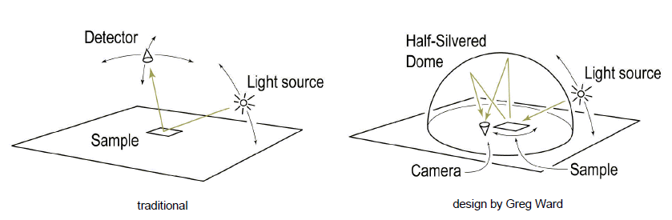

# Multiple-view modeling

### 1. Initial normal estimation
When estimate the light direction, place a highly reflective sphere next to the object.

Then a fixed camera is used to capture a sequence of images of changing the direction of light source (incoming light vector).
When finding light vector, search for the point with the maximum intensity in the sphere
firstly. Then, localize the point of mirror reflection - hightlight point. Since the geometry of sphere and
viewing direction V are known. The light direction L of a certain image could be calculate through

#### 1.1 Get data from the given path
Project description has already give the data link which contains some
images and light vector.
#### 1.2 Uniform resampling for light direction
(1) Build virtual light direction sphere - build a standard icosahedron. Then,
perform subdivision on each face 4 times recursively and get the vertices coordinates.
Assume the sample object locates at the center of the light direction sphere.
In this model, assume the light source move above the sphere surface. When a light
source acts along the line between light source and sphere center, find the nearest
vetex and use its coordinate (surface normal N) as Lo. Since the sample is treated
as fully diffuse object, the outcoming light radiance Ie does not depend on viewing
direction. It dose depend on direction of illumination, which could be expressed by the
angle between light direction and normal direction of sample. Hence, the light radiance
(brightness) Ie = k_d * cos(theata) * Ii, where Ii is the incoming light radiance.

Since light vector Li could represent light direction and N is surface normal vector,
cos(theata) = N * Li after normalizing N and Li ( ||N|| = ||Li|| = 1). Hence, lambert's
law could be expressed as following equation.

(2) Hence, get incoming light vector Li of sphere's highlight in each image i
in data set from lightvec file, which represent in (x,y,z). Normalize it before use
(||Li|| = 1).

(3) Find the vertex, which has the nearest surface normal N (||N|| = 1) with Li.
Then, let Lo = N.

(4) According to lambert's law and let k_d = 1. Interpolate the image light randiance Io at Lo by

                                                          Lo * Li' * Ii(x,y)
           Io(x,y) = sum_{i | Li's NN == Lo} * -------------------------------------
                                                   sum_{i | Li's NN == Lo} Lo * Li'

Ii(x,y) is the intensity at pixel (x,y) of i_th image in the image dataset. Set the i_th image in the center
of the light direction sphere. With given vector, find the coordinates of nearest vextex of light vector Li.
Then make Lo=N as shown in (3). The outcoming radiance (brightness) of pixel (x,y)
Ie(x,y) = k_d * Lo * Li * Ii(x,y) = Lo * Li * Ii(x,y) when assuming k_d = 1.
Then devide Ie with wights sum_{i | Li's NN == Lo} Lo * Li', get the weighted light radiance of each image Io.
The set of Io become the resampled images.

#### 1.3 Denominator image - automatic selection
(choose an image to cancel out the  surface albedo by producing ratio images)

(1) Stack the resampled images into a space-time volume - This process has been done in Section 1.2 (4)

(2) Get pixel intensities of each images in the space-time sequence - It is still in one matrix (x,y,img_num).

(3) Rank pixel intensities - for each pixel location (x,y), sort the corresponding pixel
intensities over time (the index of img_num). Then, the intensity rank at (x,y) is gotten.
Then, the intensity rank at (x,y) is greater than the median and smaller than the given
upper bound, it has a high probability to be free of shadows and highlight. In the paper,
the lower bound is 70% and the upper bound is 90% of whole image.
- kiL: total number of pixels in image(i) satisfiy 0.7 * num_img < rank(i) in image(i)
- riL: mean rank among the pixels in image(i) that satisfy rank < 0.7 * num_img.

Denominator img: the image with maximum kL and rL < 0.9 * num_img
Denominartor light: the light vector of denominator image.

#### 1.4 Initial normal estimation
(1) Get the light vectors exclude light vector of denominator image (Lrest).

(2) Get the image index exclude denominator image (Irest)

(3) Get the local initial normal by Single value decomposition (SVD) - last column of V matrix.
Remember to keep all normal in the same direction (reverse normal with negative z)

### 2. Normal refinement by MRF using graph cuts
#### 2.1 Create labels with z>0 on 5-times subdivided icosahedron
To increate precision, implement 5 times recursive subdivision of each face of an icosahedron.
Get the vertice information in the sphere. |L|=5057 --> filter out light vectors with z>0,
L is a discrete set of labels corresponding to different normal orientations.

#### 2.2 Construct graph
According to the given information in project description, use GCO 3.0 to construct graph.

#### 2.3 Minimize energy functions
Use GCO_expansion to calculate the min energy. Then use GCO_Getlabeling to get the label of segmentation result.

### 3. Build model
With refine normals of all pixels, reconstruct surface of all pixels.
Make use of function [shapeletsurf()][].

[shapeletsurf()]:http://www.peterkovesi.com/matlabfns/Shapelet/shapeletsurf.m "a"

